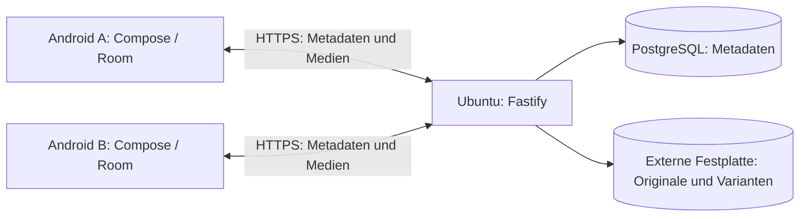

# Architektur

Stand: 14.09.2026. Zielentwurf; nur der leere Server-Bootstrap und Docker-Konfiguration existieren bereits.

## Umfang und Entscheidungen

Zwei Nutzer mit zunächst je einem Android-Gerät teilen ausgewählte vorhandene Alben in beide Richtungen. Ein privater Ubuntu-Server ist die autoritative Quelle für Freigaben, Metadaten und gespeicherte Medien. Kein Cloud-Medienspeicher, kein externer Bildproxy, kein Firebase. Android ausschließlich Kotlin und Jetpack Compose.

| Bereich | Entscheidung | Begründung |
| --- | --- | --- |
| Backend | Node.js 24 LTS, TypeScript, Fastify 5 | Kleine modulare HTTP-Anwendung, TypeScript-Unterstützung und Schema-Validierung; kein Microservice-Betrieb nötig. |
| Datenbank | PostgreSQL 17 in Docker | Transaktionen, Constraints, zuverlässige relationale Zuordnung. |
| DB-Zugriff | Prisma ORM | Typisierter Client und versionierte SQL-Migrationen; komplexe Sync-Sperren bei Bedarf über parametrisierte SQL-Abfragen in derselben Transaktion. |
| Android-Netzwerk | Retrofit 3 mit OkHttp und Kotlin-Serialization-Konverter | Typisierte HTTP-Verträge, Streaming und abbrechbare Aufrufe über Coroutines; keine Videos vollständig im RAM. |
| Lokal | Room über SQLite, Flow | Persistente Metadaten, Outbox und Sync-Zustand; Medienbytes liegen als Dateien außerhalb der DB. |
| Hintergrundarbeit | WorkManager | Dauerhafte, wiederholbare Arbeit unter Android-Netzwerk-/Energiebedingungen; keine Echtzeitgarantie. |
| UI | Jetpack Compose mit ViewModels | Native Android-Oberfläche, beobachtet Room-Zustand. |

Prisma bezeichnet hier die ORM-Bibliothek, nicht einen gehosteten Datenbankdienst. Nur Fastify ist bereits als Laufzeitabhängigkeit eingebunden. Andere Bibliotheken erhalten beim ersten Einsatz feste kompatible Versionen. npm-Lockfile fixiert den Server-Build. Docker-Tags fixieren Major-Versionen, sind aber noch nicht per Digest eingefroren; vor produktiven Releases Digests und Updateprozess ergänzen.

## Datenfluss

Ein Backend-Prozess mit Modulen für Identitäten, Alben, Sync und Speicher genügt. Später läuft ein wiederaufnehmbarer Hintergrundjob für Varianten und Papierkorb; zunächst kein Redis oder separater Broker nötig. Jobs liegen in PostgreSQL.

## Android-Alben und lokale Speicherung

MediaStore liefert zugängliche Bilder/Videos; Ordneralben werden über Volume und Bucket zugeordnet, nie nur über ihren Namen. Herstelleralben, virtuelle Alben und ausschließlich in einer fremden Cloud vorhandene Dateien sind nicht automatisch abbildbar. Die erste Version unterstützt lokal zugängliche MediaStore-Ordneralben. Der Photo Picker allein ermöglicht keine dauerhafte Beobachtung ganzer Alben.

Beide Nutzer wählen unabhängig ihre Quellalben; der Partner erhält Lesezugriff innerhalb PhotoSync. Neu gefundene Medien eines ausgewählten Albums werden später automatisch berücksichtigt. Berechtigungsentzug, eingeschränkter Fotozugriff und nicht verfügbare Volumes sind keine Löschsignale. Änderungen der MediaStore-Version erfordern erneute Inventarisierung. Android-IDs gelten nur innerhalb des Geräts und der aktuellen Zuordnung.

Partnerdateien werden nicht in MediaStore oder öffentliche Galerieordner geschrieben. Vorschaubilder und kurzfristig benötigte Medien liegen im begrenzten appinternen Cache. Später ausdrücklich angeforderte Offline-Dateien liegen im dauerhaften appinternen Dateiverzeichnis und werden durch Room verwaltet. Android-Auto-Backup und Gerätemigration für Medien, DB und Tokens beim Manifestaufbau ausschließen, damit keine Mediendateien über Systembackups in eine Cloud gelangen.

Spätere Offline-Modi: `none`, `optimized`, `original`. Optimiert nutzt verkleinerte Bilder und Videoableitungen; Original lädt unveränderte gespeicherte Bytes. Limits, LRU für ungebundene Cachedateien und Speicherprüfung verhindern unkontrolliertes Wachstum. Gepinnte Offline-Dateien nicht stillschweigend durch LRU entfernen; unzureichenden Platz sichtbar melden. Formate und Qualitätsstufen sind offen.

## Speicher und Betrieb

`PHOTOSYNC_MEDIA_PATH` konfiguriert den Hostpfad, im Container ist er `/media/photosync`. Originale, Varianten und temporäre Uploads liegen unter diesem Root; PostgreSQL liegt im eigenen persistenten Docker-Volume. Datenbank speichert relative, servergenerierte Objektschlüssel, keine vom Client vorgegebenen Pfade. Medienzugriff erfolgt über autorisierte API-Routen, kein öffentlicher statischer Dateiserver.

Compose erzeugt einen fehlenden Bind-Pfad nicht automatisch. Vor echten Uploads zusätzlich Mount-Identität/Marker, Schreibbarkeit und freien Platz prüfen: Ein vorhandener leerer Mountpoint beweist keine angeschlossene Festplatte. Bei fehlendem Datenträger Schreibvorgänge und Bereinigungen stoppen; niemals auf Containerdateisystem ausweichen. Temporärdatei und finales Objekt auf demselben Dateisystem erlauben atomare Umbenennung. DB und Dateisystem sind keine gemeinsame Transaktion: gestufte Zustände und ein Reparaturjob sind erforderlich.

Nur der Eigentümer verändert seine Alben und Medien; der Partner liest. Paarzuordnung begrenzt auf zwei aktive Mitglieder. Jede Medien-, Thumbnail- und Downloadanfrage prüft aktuelle Berechtigung. Vor produktivem Zugriff sind Geräteanmeldung, widerrufbare Tokens und HTTPS Pflicht; aktuelles Compose ist nur ein lokales Entwicklungsgerüst. VPN versus öffentlich erreichbarer TLS-Reverse-Proxy bleibt offen.

Originale sind unveränderlich. Entfernen eines lokalen Originals oder Abwählen eines Albums löscht keine Serverdatei. Abwählen beendet die Freigabe. Explizites Löschen in PhotoSync verschiebt ein Medium für 30 Tage in den Papierkorb; Partnerzugriff endet sofort. Wiederherstellung bis zur Frist stellt vorhandene Mitgliedschaften wieder her, aber keine widerrufenen Freigaben. Danach löscht ein wiederholbarer Job Original und Varianten; Tombstones bleiben für Sync erhalten.

Private Backups von Datenbank und Festplatte auf getrennte eigene Hardware planen und Wiederherstellung testen. Papierkorb ersetzt kein Backup. Abgelaufene Medien können in älteren Backups verbleiben; endgültige Backup-Retention vor Betrieb definieren.

## Offene Entscheidungen vor Implementierung

- Android-Geräteversionen, unterstützte Albumtypen im Gerätetest, SDK-/Gradle-Matrix und EXIF-Standortberechtigung. Ohne diese ist ein unverändertes Original gegebenenfalls nicht vollständig lesbar; keine stillschweigende Originalgarantie.
- Einrichtung der zwei Konten, Pairing, Tokenlebensdauer und Zugang über VPN oder TLS-Reverse-Proxy.
- Variantenformate, Videotranscoding, Offline-Budgets, Uploadgrenzen und Mobilfunkregeln.
- Festplattenformat/Mountüberwachung, Backup-Retention, Verschlüsselung ruhender Daten und Produktions-Image-Digests.
- Konkrete Prisma-Version, erste Migration, API-Schemas und Aufbewahrungszeiten des Sync-Protokolls.

## Offizielle Grundlagen

- [Fastify TypeScript](https://fastify.dev/docs/latest/Reference/TypeScript/) und [LTS-Regeln](https://github.com/fastify/fastify/blob/main/docs/Reference/LTS.md).
- [Node.js Releases](https://nodejs.org/en/about/previous-releases), [PostgreSQL Support](https://www.postgresql.org/support/versioning/).
- [Prisma PostgreSQL-Connector](https://docs.prisma.io/docs/orm/core-concepts/supported-databases/postgresql).
- [Retrofit Releases](https://github.com/square/retrofit/releases).
- [Room](https://developer.android.com/training/data-storage/room) und [Offline-first Android](https://developer.android.com/topic/architecture/data-layer/offline-first).
- [MediaStore und Berechtigungen](https://developer.android.com/training/data-storage/shared/media).
