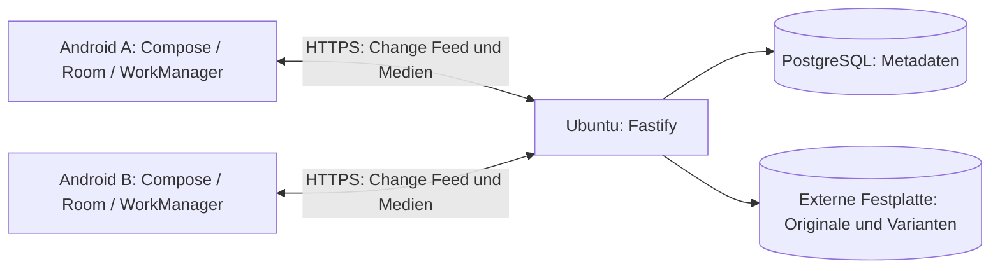

# Architektur

Stand: 20.09.2026. Geräteauthentifizierung, Album-/Assetmetadaten, resumierbare und atomar finalisierte Originaluploads, resumierbare Offline-Downloads, geleaste Serverderivate, Partnergalerie, privates Auto-Backup sowie 90-Tage-Papierkorb und Restore sind implementiert. MediaStore-Hinweise und Kontrollscan speisen eine gemeinsame persistente Queue; WorkManager synchronisiert mit Netzwerk-Backoff. Ein transaktionales Serverjournal wird über persistente Room-Cursor verarbeitet. Optionales FCM beschleunigt nur das Aufwecken.

## Umfang und Entscheidungen

Zwei Nutzer mit zunächst je einem Android-Gerät teilen ausgewählte vorhandene Alben in beide Richtungen. Ein privater Ubuntu-Server ist die autoritative Quelle für Freigaben, Metadaten und gespeicherte Medien. Kein Cloud-Medienspeicher und kein externer Bildproxy; Firebase Cloud Messaging ist optional und transportiert ausschließlich einen inhaltslosen Sync-Wakeup. Android ausschließlich Kotlin und Jetpack Compose.

| Bereich | Entscheidung | Begründung |
| --- | --- | --- |
| Backend | Node.js 24 LTS, TypeScript, Fastify 5 | Kleine modulare HTTP-Anwendung, TypeScript-Unterstützung und Schema-Validierung; kein Microservice-Betrieb nötig. |
| Datenbank | PostgreSQL 17 in Docker | Transaktionen, Constraints, zuverlässige relationale Zuordnung. |
| DB-Zugriff | Prisma ORM | Typisierter Client und versionierte SQL-Migrationen; komplexe Sync-Sperren bei Bedarf über parametrisierte SQL-Abfragen in derselben Transaktion. |
| Android-Netzwerk | Retrofit 3 mit OkHttp und Kotlin-Serialization-Konverter | Typisierte HTTP-Verträge, Streaming und abbrechbare Aufrufe über Coroutines; keine Videos vollständig im RAM. Große Transfers können persistent auf unmetered/WLAN begrenzt werden, Steuerdaten bleiben mit CONNECTED möglich. |
| Lokal | Room über SQLite, Flow | Persistente Metadaten, Outbox und Sync-Zustand; Medienbytes liegen als Dateien außerhalb der DB. |
| Hintergrundarbeit | WorkManager 2.11 | Persistente eindeutige Sofortarbeit, MediaStore-Trigger, netzunabhängiger Kontrollscan und Netzwerkabgleich mit Backoff; keine Echtzeitgarantie. |
| UI | Jetpack Compose mit ViewModels | Native Android-Oberfläche, beobachtet Room-Zustand. |
| Lokale Galerie | Android MediaStore über Volume und Bucket | Liest bestehende Ordneralben ohne neue Medienordner anzulegen; unterstützt vollständigen und unter Android 14 eingeschränkten Medienzugriff. |
| Galerie-Paging | AndroidX Paging 3.3 | Lädt die Medien eines geöffneten Albums in Seiten und begrenzt Cursor- und Objektmengen bei großen Bibliotheken. |
| Server-Derivate | Sharp 0.35.4/libvips für Bilder; FFmpeg/libx264 für Video | Persistente PostgreSQL-Jobs, atomare Dateien, kompatible WebP- und H.264/MP4-Ausgaben; Profil in [media-derivatives.md](media-derivatives.md). |
| Vorschaubilder | Coil 3.2 mit Video-Decoder | Decodiert Bilder und Video-Frames auf die angeforderte Kachelgröße statt vollständige Originale als Bitmap in den RAM zu laden. |

Prisma bezeichnet hier die ORM-Bibliothek, nicht einen gehosteten Datenbankdienst. Fastify, Prisma ORM/Client und PostgreSQL-Adapter 7.10.0, pg, Pino und Zod sind eingebunden. Zod validiert die Prozesskonfiguration vor dem Start. Andere Bibliotheken erhalten beim ersten Einsatz feste kompatible Versionen. npm-Lockfile fixiert den Server-Build. Docker-Tags fixieren Major-Versionen, sind aber noch nicht per Digest eingefroren; vor produktiven Releases Digests und Updateprozess ergänzen.

## Datenfluss

Ein Backend-Prozess mit Modulen für Identitäten, Alben, Sync und Speicher genügt. Der wiederaufnehmbare Derivatworker, der idempotente Papierkorb-Cleanup und optional der FCM-Wakeup-Absender laufen im Backend-Prozess; PostgreSQL dient als persistente Queue und Change-Journal, ohne Redis oder separaten Broker.

## Android-Alben und lokale Speicherung

MediaStore liefert zugängliche Bilder/Videos; Ordneralben werden über Volume und Bucket zugeordnet, nie nur über ihren Namen. Herstelleralben, virtuelle Alben und ausschließlich in einer fremden Cloud vorhandene Dateien sind nicht automatisch abbildbar. Die erste Version unterstützt lokal zugängliche MediaStore-Ordneralben. Der Photo Picker allein ermöglicht keine dauerhafte Beobachtung ganzer Alben.

Beide Nutzer wählen unabhängig ihre Quellalben; der Partner erhält Lesezugriff innerhalb PhotoSync. Neu gefundene oder geänderte Medien eines ausgewählten Albums werden durch Änderungshinweis oder spätestens einen späteren Kontrollscan berücksichtigt. Berechtigungsentzug, eingeschränkter Fotozugriff und nicht verfügbare Volumes sind keine Löschsignale. Änderungen der MediaStore-Version erfordern erneute Inventarisierung. Android-IDs gelten nur innerhalb des Geräts und der aktuellen Zuordnung.

Partnerdateien werden nicht in MediaStore oder öffentliche Galerieordner geschrieben. Vorschaubilder und kurzfristig benötigte Medien liegen im begrenzten appinternen Cache. Ausdrücklich angeforderte Offline-Dateien liegen im dauerhaften appinternen Dateiverzeichnis und werden durch Room verwaltet. Android-Auto-Backup und Gerätemigration für Medien, DB und Tokens sind ausgeschlossen, damit keine Mediendateien über Systembackups in eine Cloud gelangen.

Offline-Modi: `none`, `optimized`, `original`. Optimiert nutzt verkleinerte Bilder und Videoableitungen; Original lädt unveränderte gespeicherte Bytes. Limits, LRU für ungebundene Cachedateien und Speicherprüfung verhindern unkontrolliertes Wachstum. Gepinnte Offline-Dateien werden nicht durch LRU entfernt; unzureichender Platz bleibt als wiederholbarer Fehler sichtbar.

Die normale Albumansicht kennt weiterhin nur „mit Partner geteilt“ oder „nicht geteilt“. Auto-Backup ist eine interne Einstellung und ein serverseitiger Marker (backedUpAt), kein dritter sichtbarer Albumstatus. Bei aktivem Auto-Backup inventarisiert der Kontrollscan alle sichtbaren Bilder/Videos, nutzt dieselbe Room-Queue und dieselbe idempotente Album-/Asset-Identität. Das Backup bleibt privat, bis der Eigentümer ausdrücklich teilt. Ausschalten stoppt nur neue private Sicherungen; vorhandene Backups und ausdrücklich geteilte Alben bleiben bestehen. Die Einstellungen zeigen Profil, Partnerstatus, WLAN-only, Auto-Backup, Fehlerbenachrichtigung und einen verständlichen Verbindungsstatus; technische Cache-Größen und Limits bleiben aus der normalen Oberfläche heraus.

Die Hauptnavigation besteht aus den zwei Fotozielen **Meine Alben** und **Partner**. Einstellungen und Papierkorb sind sekundäre Ziele im Overflow-Menü der Top-App-Bar und belegen keine eigenen Haupttabs.

Albumübersichten und geöffnete Medienraster verwenden ein `enterAlways`-Scrollverhalten für kompakte Top-Bars. Geöffnete Alben und Viewer liegen als vollflächige Ziele über der Hauptnavigation, damit App-Bar und Tabs keine Bildfläche belegen. Eine zentrale Compose-Pointer-Geste ändert ausschließlich bei zwei aktiven Fingern die Grid-Dichte: Albumraster erlauben eine bis vier, Medienraster zwei bis sieben Spalten; Einfinger-Scrollen bleibt vollständig bei `LazyVerticalGrid`. Die gewählte Dichte wird pro geöffnetem Screen mit `rememberSaveable` gehalten.

## Speicher und Betrieb

`PHOTOSYNC_DEV_MEDIA_PATH` und `PHOTOSYNC_PROD_MEDIA_PATH` konfigurieren getrennte Hostpfade. Das Backend wählt über `NODE_ENV` zwischen `MEDIA_DEV_ROOT` und `MEDIA_PROD_ROOT`; Compose mountet nur den jeweiligen Pfad nach `/media/development` beziehungsweise `/media/production`. Auch Upload-Sitzungen speichern ausschließlich relative Pfade unter diesem Root, sodass die spätere 4-TB-Platte keine Codeänderung benötigt. PostgreSQL liegt im eigenen persistenten Docker-Volume. Medienzugriff erfolgt über autorisierte API-Routen, kein öffentlicher statischer Dateiserver. Optional ergänzt `CATALOG_ROOT` eine ausschließlich lokale, regenerierbare Host-Projektion: `Alben/` enthält alle gültigen aktiven Originale je Eigentümer, `Auto-Backup/` zusätzlich alle privaten Backup-Zuordnungen und `Papierkorb/` die noch wiederherstellbaren Originale. Diese Einträge sind Symlinks, keine Kopien; weder Fastify noch der Reverse Proxy mounten oder veröffentlichen sie als HTTP-Ressource.

Compose erzeugt einen fehlenden Bind-Pfad nicht automatisch. Vor echten Uploads zusätzlich Mount-Identität/Marker, Schreibbarkeit und freien Platz prüfen: Ein vorhandener leerer Mountpoint beweist keine angeschlossene Festplatte. Bei fehlendem Datenträger Schreibvorgänge und Bereinigungen stoppen; niemals auf Containerdateisystem ausweichen. Temporärdatei und finales Objekt auf demselben Dateisystem erlauben atomare Umbenennung. DB und Dateisystem sind keine gemeinsame Transaktion. Persistente Sitzungsoffsets, erneuerte Leases und Recovery schließen beide Crashfenster: unbestätigte Part-Bytes werden zurückgekürzt, ein bereits umbenanntes vollständiges Original wird fertig committed. Derivatworker erneuern eigene Ablauf-Leases während langer Verarbeitung und verwenden claim-eigene Finalpfade; ein verlorener Claim kann die Ausgabe des Gewinners nicht entfernen. Fehlende oder beschädigte fertige Derivate werden sicher neu eingeplant. Aktive Originale werden periodisch und vor Auslieferung auf Existenz, Größe und SHA-256 geprüft; Fehler bleiben als Diagnosezustand sichtbar und werden ohne sichere Quelle niemals destruktiv erraten.

Nur der Eigentümer verändert seine Alben und Medien; der Partner liest. Paarzuordnung begrenzt auf zwei aktive Mitglieder. Jede Medien-, Thumbnail- und Downloadanfrage prüft aktuelle Berechtigung. Geräteanmeldung und widerrufbare, serverseitig gehashte Tokens sind implementiert; vor Zugriff über das Netzwerk ist zusätzlich HTTPS einzurichten. Details stehen in [api.md](api.md). VPN versus öffentlich erreichbarer TLS-Reverse-Proxy bleibt offen.

Originale sind unveränderlich. Nur ein nachweislich vollständiger MediaStore-Scan mit voller Berechtigung darf ein fehlendes lokales Original als Löschung interpretieren; eingeschränkter Zugriff, Queryfehler und fehlende Volumes dürfen das nie. Abwählen eines Albums beendet nur die Freigabe. Explizites Löschen in PhotoSync verschiebt ein Medium für 90 Tage in den Papierkorb; Partnerzugriff endet sofort. Wiederherstellung bis zur Frist stellt vorhandene Mitgliedschaften wieder her, aber keine widerrufenen Freigaben. Danach löscht ein geleaster, wiederholbarer Job Original und Varianten; nach Beginn dieses irreversiblen Zustands ist Restore gesperrt. Tombstones bleiben für Sync erhalten.

Private Backups von Datenbank und Festplatte auf getrennte eigene Hardware planen und Wiederherstellung testen. Papierkorb ersetzt kein Backup. Abgelaufene Medien können in älteren Backups verbleiben; endgültige Backup-Retention vor Betrieb definieren.

## Offene Entscheidungen vor Implementierung

- Android-Geräteversionen, unterstützte Albumtypen im Gerätetest, SDK-/Gradle-Matrix und EXIF-Standortberechtigung. Ohne diese ist ein unverändertes Original gegebenenfalls nicht vollständig lesbar; keine stillschweigende Originalgarantie.
- Zugang über VPN oder TLS-Reverse-Proxy. Lokales Betreiber-Recovery bei Verlust aller Geräte ist über einen ausschließlich im Servercontainer verfügbaren CLI-Befehl umgesetzt; es erzeugt auditierbare, gehashte Einmalcodes ohne öffentlichen Admin-Endpunkt.
- HDR-/10-Bit-Tone-Mapping, Offline-Budgets, Uploadgrenzen und Mobilfunkregeln.
- Festplattenformat/Mountüberwachung, Backup-Retention, Verschlüsselung ruhender Daten und Produktions-Image-Digests.
- Fachliche Migrationen, API-Schemas und Aufbewahrungszeiten des Sync-Protokolls. Die technische Baseline ist bereits migrierbar.

## Offizielle Grundlagen

- [Fastify TypeScript](https://fastify.dev/docs/latest/Reference/TypeScript/) und [LTS-Regeln](https://github.com/fastify/fastify/blob/main/docs/Reference/LTS.md).
- [Node.js Releases](https://nodejs.org/en/about/previous-releases), [PostgreSQL Support](https://www.postgresql.org/support/versioning/).
- [Prisma PostgreSQL-Connector](https://docs.prisma.io/docs/orm/core-concepts/supported-databases/postgresql).
- [Retrofit Releases](https://github.com/square/retrofit/releases).
- [Room](https://developer.android.com/training/data-storage/room) und [Offline-first Android](https://developer.android.com/topic/architecture/data-layer/offline-first).
- [MediaStore und Berechtigungen](https://developer.android.com/training/data-storage/shared/media).

## Partnergalerie

Der Partner-Tab fragt ausschliesslich einen schmalen Partneralbum-Endpunkt ab; die Serverberechtigung begrenzt ihn auf freigegebene Alben des anderen Accounts. Albumkarten enthalten nur Zaehler und ein optionales Cover. Ein geoeffnetes Album nutzt cursorbasiertes Paging (60 Metadaten, begrenzter Prefetch), keine Gesamtliste und keine vorsorglichen Originaldownloads.

Im Android-cacheDir liegen getrennte, jederzeit loeschbare Partner-Cachebereiche: LRU-Dateien fuer Thumbnail/optimierte Bilder sowie der Media3-Range-Cache fuer optimierte Videos. Variantentyp, Derivatzeitpunkt und Hash gehoeren zum Schluessel. Bildcache-Finals werden vor Wiederverwendung per SHA-256 validiert; Download und Copy-Fallback schreiben nur `.part` und finalisieren atomar. Dieser fluechtige Cache ist nicht Room-verwaltet und technisch strikt vom erst in Schritt 10 geplanten Offline-Dateispeicher getrennt. Fotos laden beim Oeffnen nur die optimierte Variante und unterstuetzen Zoom; ein Nutzer kann Partnerbilder lokal in 90-Grad-Schritten drehen. Dieser persistente Anzeige-Override ist nach Server- und Nutzerkontext getrennt und verändert niemals das Partner-Original. Videos spielen die optimierte MP4 per Range-Streaming ab.

## Dauerhafte Accounts und Reinstall

Philip und Runa sind feste Serveraccounts mit normalisiertem Login-Namen und Argon2id-Passwort. Jede erfolgreiche Anmeldung registriert lediglich ein neues widerrufbares Gerät. Release-Builds verwenden fest https://philsync.duckdns.org und zeigen nur Benutzername, Passwort und Anmelden.

Die fachliche Albumquelle ist ownerUserId plus MediaStore-Volume plus normalisierter RelativePath. Android gleicht nach Login eigene Serveralben mit lokalen MediaStore-Alben ab und übernimmt Server-ID, Share- und Backup-Status, bevor es inventarisiert. Der Server-Constraint verhindert parallele Alben derselben Quelle. Der Inhalts-Hash-Constraint im Album verhindert einen zweiten Asset-/Originalupload nach Reinstall.

Eigene backedUp-Alben sind über einen separaten autorisierten Endpunkt sichtbar. Backup wiederherstellen nutzt die bestehende persistente, resumierbare Offline-Downloadqueue mit ORIGINAL-Variante und accountgescopten Pfaden; Partnerbackups werden nie geliefert.
